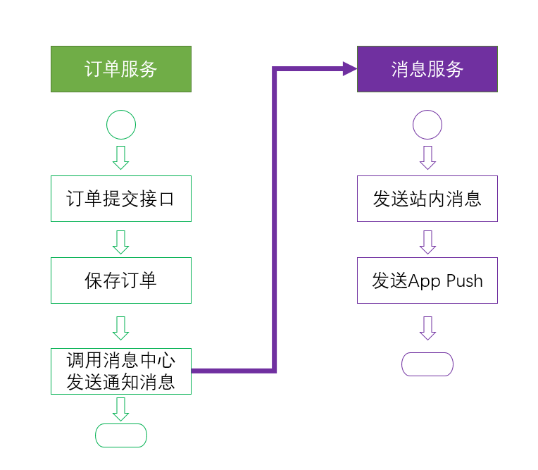

# ASP.NET Core扩展库之Http请求模拟

如今完全独立的业务应用几乎不存在，不管是在企业内部微服务之间的调用，还是与外部第三方服务的调用，Http的API交互是常见的场景，这些实际情况给我们的开发带来了比较大的挑战，一是第三方服务可能会牵制我们的开发进度，特别是在多团队开发的情况下，由于依赖于其他团队的服务，有时候需要等待其他团队的进度，导致自己团队的无效等待。有时因为其他团队的延期，导致团队的被动延期。二是第三方服务的质量问题或开发过程中的频繁更新导致的部署问题，将严重拖累自己团队的开发进度，同时让你无法专心的开发自己的服务。三是单元测试困难，特别是在依赖于多个第三方服务时，使得单元测试可能依赖于其他服务环境，导致单元测试结果的不确定性。

为了解决以上这些问题，Xfrogcn.AspNetCore.Extensions扩展库提供了Http请求模拟的功能，通过此功能可以让你在开发、单元测试时实现你的服务与第三方服务的完全解耦，让你能够更聚焦于自己服务的开发。

Http请求模拟构建在.NET Core HttpClientFactory架构之上，通过在HttpClient请求管道中替换实际发送Http请求的主消息处理器为模拟消息处理器来完成请求的模拟应答。

## 在服务端使用

假设我们负责开发一个订单服务，在订单提交接口，我们保存完订单数据之后，需要发送消息通知，消息通知的发送由消息服务来实现，该服务由另一团队负责，如下图所示：



由于订单服务依赖于消息服务，在项目启动时，一般两个团队会协商好消息服务的接口定义，然后消息服务团队会快速搭建一个空接口供订单服务团队调用，如果是这种流程，订单服务团队只需等待消息服务团队搭建好环境即可开始工作，好像影响不大，但在实际开发过程中，会存在以下现实的问题：

- 虽然消息服务团队提供空接口的时间不长，但是如果项目工期紧张，计划都是以小时计算，那么这也将影响订单服务的开发进度
- “空消息服务”实际上无法一直保持空的状态，消息服务团队会不断对服务进行更新加入他们的实现逻辑，而消息服务本身也可能依赖于其他的服务，这导致订单团队所使用的消息服务不稳定，那么订单团队的进度实际上还是会受到消息服务团队，以及消息服务所依赖的其他团队的影响。
- 订单服务团队可以使用空的消息服务，但消息服务团队往往需要连接企业外部的第三方服务，比如App的消息推送通道，这让整个项目依赖更加复杂。
- 订单服务团队编写单元测试会比较困难（当然，此点可以通过抽象来解决，但结合扩展库的Http请求模拟功能，我们可以简化此过程）

以下介绍如何使用扩展库的请求模拟功能。

为了聚焦于模拟功能的演示，该示例进行了简化，比如与消息服务的通讯，在正式项目中会通过消息服务的SDK来完成，示例中将直接使用HttpClient，有关SDK与扩展库的结合，我们将在后续文章中说明。

1. 引用Xfrogcn.AspNetCore.Extensions
2. 定义订单类

```c#
    public class Order
    {
        public string Id { get; set; }

        public string ProductCode { get; set; }

        public decimal Price { get; set; }
        
        public int Quantity { get; set; }

        public decimal Amount { get; set; }
    }
```

3. 定义消息发送请求类

```c#
    public class SendMessageRequest
    {
        public string MessageId { get; set; }

        public string Message { get; set; }

        public List<int> UserIds { get; set; }
    }
```

4. 配置

在Starup ConfigureServices方法中配置模拟

```c#
        public void ConfigureServices(IServiceCollection services)
        {
            services.AddControllers();
            // 启用扩展库
            services.AddExtensions(Configuration);

            // 消息服务所使用的HttpClient名称MESSAGESERVICE
            IHttpClientBuilder messageClient = services.AddHttpClient("MESSAGESERVICE", client =>
            {
                // 设置基础地址
                client.BaseAddress = new Uri("http://api.hello.com/");
            });
            // 只有Mock配置设置为true时，才启用，通过开发应用配置文件来配置
            if (Configuration.GetValue<bool>("Mock"))
            {
                // 配置针对消息服务客户端，POST到/message/send接口的请求，都将返回一个ResponseMessage
                messageClient.AddMockHttpMessageHandler()
                    .AddMock<ResponseMessage>("/message/send", HttpMethod.Post, new ResponseMessage());
            } 

        }
```

注意，以上通过配置中的Mock属性来决定是否开启模拟功能，为了不影响正式发布，可以通过开发环境配置(appsettings.Development.json)来开启模拟：

```json
{
  "Mock": true
}
```

5. 控制器

```c#
    [Route("api/order")]
    [ApiController]
    public class OrderController : ControllerBase
    {
        readonly HttpClient messageClient;
        public OrderController(IHttpClientFactory clientFactory)
        {
            // 创建消息服务所使用的客户端，名称与配置所使用的名称一致
            // 实际项目中千万不要写上哦~
            messageClient = clientFactory.CreateClient("MESSAGESERVICE");
        }

        [HttpPost]
        public async Task<ResponseMessage> SaveOrder([FromBody]Order order)
        {
            // 保存订单，省略了....
            // 调用消息服务接口
            ResponseMessage response = await messageClient.PostAsync<ResponseMessage>(
                "/message/send", new SendMessageRequest()
                {
                    MessageId = Guid.NewGuid().ToString("N").ToLower(),
                    Message = "订单已提交",
                    UserIds = new List<int>() { 1,2,3}
                });
            // 根据消息服务返回应答继续处理，省略了...

            return response;
        }
    }
```

6. 启动，然后通过Api测试工具（如Postman）向/api/order POST请求，接口将返回以下应答：

```c#
{
    "code": "0",
    "message": null,
    "isSuccess": true
}
```

如上，通过Http请求模拟，我们实现了订单服务对消息服务的依赖。

## 在单元测试中使用

单元测试中，针对模拟应答的配置是一样的，我们可以通过测试用例模拟各种不同的应答，包括异常，来对执行路径进行测试。

```c#
[Fact]
        public async Task Test1()
        {
            IServiceCollection services = new ServiceCollection()
                .AddExtensions();

            services.AddHttpClient("TESTCLIENT")
                .AddMockHttpMessageHandler()
                // 请求/test/exception将触发异常
                .AddMock("/test/exception", HttpMethod.Get, new Exception(""))
                // 针对 /test/404 返回404应答
                .AddMock("/test/404", HttpMethod.Get, HttpStatusCode.NotFound)
                // 返回指定类型
                .AddMock<int>("/test/obj", HttpMethod.Get, 100)
                // 自定义条件及应答
                .AddMock(request =>
                {
                    if (request.Headers.Contains("hello"))
                    {
                        return true;
                    }
                    return false;
                }, async (request, response) =>
                {
                    // 如果是调用第三方服务，你可以在这里检查request发出的请求内容是否正确

                    // 自定义应答内容
                    await response.WriteObjectAsync(new
                    {
                        test = "Hello World"
                    });
                })
                // 针对所有请求返回字符串Hello
                .AddMock("*", HttpMethod.Get, "Hello");

            IServiceProvider provider = services.BuildServiceProvider();

            IHttpClientFactory clientFactory = provider.GetRequiredService<IHttpClientFactory>();
            HttpClient client = clientFactory.CreateClient("TESTCLIENT");
            client.BaseAddress = new Uri("http://localhost");

            HttpResponseMessage resposne = await client.GetAsync("/test/404");
            Assert.Equal(HttpStatusCode.NotFound, resposne.StatusCode);
        }
```

## 示例

详细示例请参考[GitHub](https://github.com/xfrogcn/Xfrogcn.AspNetCore.Extensions/tree/master/examples/MockHttpRequest)

Xfrogcn.AspNetCore.Extensions地址：[GitHub](https://github.com/xfrogcn/Xfrogcn.AspNetCore.Extensions) [Gitee](https://gitee.com/WuYeCai/Xfrogcn.AspNetCore.Extensions)